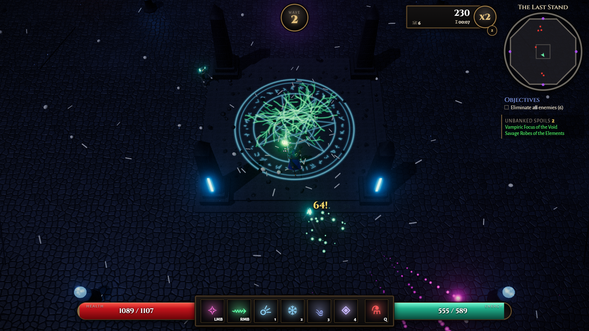
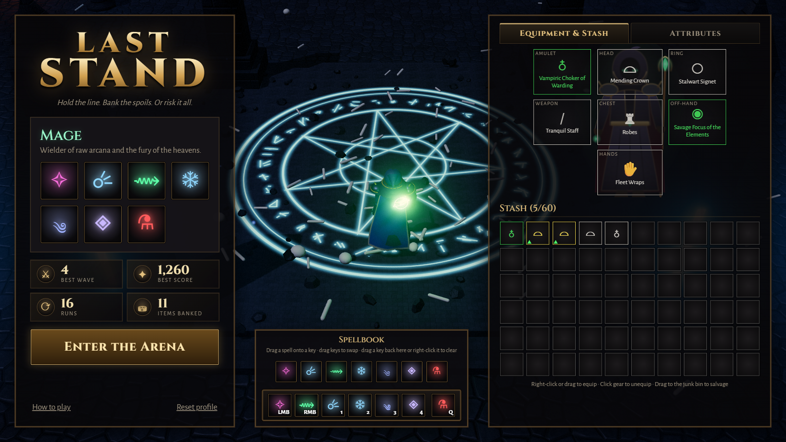
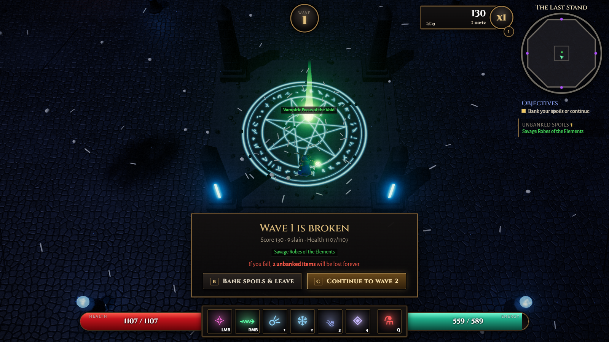

# Last Stand

[](https://github.com/VictorZakharov/last-stand/actions/workflows/deploy-pages.yml)

A 3D wave-survival action RPG that runs in your browser. Hold the arena against endless waves, and after **every** wave make the call: **bank your spoils** and walk away, or **push on** for better loot — knowing that if you fall, everything you haven't banked is lost.

**[▶ Play in your browser](https://victorzakharov.github.io/last-stand/)**

Everything is procedural: models, animation, textures, VFX and sound are generated at runtime. There are no downloaded models, textures or audio files.



| Lobby: equipment, stash & spell loadout | Wave cleared: bank or continue? |
| --- | --- |
|  |  |

## How to play

- Pick a battleground in the lobby, the **Crypt** or the **Forest** (or the dice for a random one each run). Each has its own enemies.
- Start a run at any wave up to the best one you cleared **and banked** in that battleground (the lobby defaults to it); a run you died in doesn't count. On Random, the range is the waves banked in every battleground.
- Survive each wave inside the arena. Every fifth wave, a boss arrives: the **Colossus** in the Crypt, the **Thornheart** in the Forest.
- After every wave, choose:
  - **Bank** — leave the arena and move everything you found into your stash, or
  - **Continue** — face a harder wave with better loot (you recover 25% health).
- Loot goes straight into your bag, **unseen**: you only know how many items of each rarity you carry (1 Legendary, 2 Epic...). Banking reveals what they are.
- If you die, **all unbanked spoils are lost**, never seen.
- Equip what you find between runs; items roll random affixes across five rarities.

### Play together

Two players can hold the arena together over the internet. In the lobby, **Play together** → **Open a room** gives a short code and an invite link to send a friend; opening the link (or entering the code) joins the room. There's no server: the games connect directly to each other (WebRTC), after finding each other through free public relays.

- Each player brings their own hero, gear and loadout, and keeps their own spoils: loot goes to whoever lands the kill (a boss pays everyone), and each bag stays hidden until its owner banks.
- The host picks the battleground and starting wave and starts the run. A party faces more foes, each with more life.
- After every wave everyone chooses: **Bank** leaves the run with your spoils right away; the next wave starts once everyone staying chose **Continue**. Players who left watch the rest of the run.
- At 0 health you go **down** rather than die. A teammate can raise you by standing next to you and holding **E** (the **Revive** button on touch) for 3 seconds. If you're not raised within 20 seconds, or you're still down when the wave ends, you fall and lose your spoils. With nobody left standing, the run is lost for everyone still in it.
- The game can't pause for one player: the pause menu only stops your hero. If the host leaves mid-run, the others keep what they found, as if banked.

### Install and play offline

Last Stand is an installable web app. Use the **Install** link in the lobby (Chrome, Edge, Android), or *Add to Home Screen* on iOS. Once it has loaded, it also plays without a connection. A new version downloads in the background, and the lobby offers a reload when it's ready.

### Controls

Plays with a keyboard and mouse, or by touch on phones and tablets (hold a phone sideways):
- **Move:** a stick anywhere on the left half of the screen.
- **Skills:** the buttons on the right. Tap to cast at the nearest foe, or drag to aim and let go to cast there; hold the attack button or a channelled skill to keep it going.
- **Other:** pinch to zoom, and the ❚❚ button pauses.
- **Lobby:** tap items to equip or salvage them, and tap a key, then a skill, to rebind it.

Keyboard and mouse:

| Input | Action |
| --- | --- |
| `W A S D` | Move |
| Mouse | Aim |
| Left click, right click, `1`–`4`, `Q` | Skills (see the classes below) |
| Mouse wheel | Zoom |
| Middle mouse (hold and drag) | Rotate the camera |
| `V` | Change view (in a run): top-down, over the shoulder, first person. The close views use mouse look and aim at the crosshair |
| `B` / `C` | Bank / Continue after a wave |
| `E` (hold) | Revive a downed partner (co-op) |
| `Esc` | Pause |

Skills can be **remapped in the lobby**: the chevron beside the key bar (or a click on a key) opens the spellbook (the warrior's arsenal) above it. Click a key, then a skill, or drag a skill onto any key (the same skill may sit on several keys); drag keys onto each other to swap. The loadout is saved in a cookie per class and save slot. You can also walk around and try every skill for free in the lobby, and fold its panels away to make room: the hero panel to the left, the equipment to the right and the key bar down, each by the tab on its edge (the lobby remembers).

## Classes

Pick a class in the lobby. Every class keeps its **own profile**: equipment, stash, records and the starting waves unlocked in each biome. Loot found by one class is made for it and stays with it, and each class has its own stash filter.

There are **three save slots** (the lobby's *Save slot* link), each a separate save with its own heroes, skill loadouts and stash filters. The save slots screen shows what each one holds: every hero's best wave and starting waves per battleground, gear with its item levels, skills, attributes, stash, records and time played. From there you play a slot or delete one (typing DELETE to confirm). An empty slot is a fresh start, for instance to play from the beginning with a friend. Progress from before save slots is in slot 1.

Both wear a real position-based-dynamics cloth cape that collides with the animated body, using the solver from [cape-physics](https://github.com/VictorZakharov/cape-physics).

### The Mage

Robes, skirt panels and a crystal staff; arcane and elemental spells from range.

| Key | Spell |
| --- | --- |
| Left click | Splintering Bolt — seeking arcane bolts that split on impact |
| Right click | Starfall — crystal meteors crash onto the target area |
| `1` (hold) | Void Lance — channeled piercing beam |
| `2` | Glacial Nova — freeze everything around you |
| `3` | Maelstrom — roaming vortex that pulls enemies in and shocks them |
| `4` | Arcane Aegis — damage-absorbing ward |
| `Q` | Healing Draught |

### The Warrior

Plate armour, a crested helm and a cape; tougher, and fights up close. Fights with a one-handed weapon and a shield, a one-handed weapon in each hand (the swings alternate hands; the off-hand weapon adds 60% of its damage bonus), or a two-handed weapon, and the model shows what is equipped. Each of these styles remembers its own skill bindings, with a button in the lobby to reset them to the defaults.

Shields **block**: each hit has the shield's Block Chance to be blocked, absorbing its Block Amount, after which the shield needs a moment to recover. Holding right click raises the shield to block every hit from the front, for three times the Block Amount; a hit bigger than that breaks the guard and staggers you: for 1.5 seconds you can only move, not block, attack or cast.

| Key | Skill |
| --- | --- |
| Left click | Rending Cleave — wide sweep in front of you; each hit restores energy |
| Right click (hold) | Raise Shield — block every frontal blow; with a two-handed weapon instead: Steel Tempest; with a weapon in each hand: Twin Fangs, an instant lunge and a strike with each blade (a lone one-hander leaves it free to bind; Thunder Crescent needs a two-hander) |
| `1` (hold) | Steel Tempest — spin with the blade out, shredding everything around you |
| `2` | Bull Rush — shield charge that tramples and hurls foes aside |
| `3` | Power Strike — charge for 1.5 seconds, then a crushing overhead blow |
| `4` | Iron Bellow — war cry that hurls foes back and grants a damage-absorbing ward |
| `Q` | Healing Draught |

## Tech

- [Three.js](https://threejs.org/) 0.185 with an HDR post-processing chain (bloom, tone mapping, grading)
- TypeScript (strict) + [Vite](https://vite.dev/)
- Procedural textures (cobblestone, slabs, runes), procedural humanoid rigs and animation, CPU particles, pooled dynamic lights
- WebAudio-synthesized sound effects
- Co-op over WebRTC data channels, connected through public Nostr relays ([Trystero](https://github.com/dmotz/trystero))


## Development

```bash
npm install
npm run dev        # http://localhost:5173
npm run typecheck
npm run build      # type-check + production build into dist/
```

### Project layout

| Path | Contents |
| --- | --- |
| `src/data/` | Tuning data: classes & skills, enemies, biomes, items, waves, balance |
| `src/combat/skills/` | Skill behaviors, referenced by name from class data |
| `src/entities/` | Player, enemies, enemy AI, procedural models (`models/`) |
| `src/game/run.ts` | Wave flow, scoring, loot rolls, bank / continue |
| `src/world/` | The biome arenas (`crypt.ts`, `forest.ts`), shared props, collision |
| `src/fx/` | Particles, effects, pooled lights |
| `src/loot/` | Items, persistent profiles (one per class and save slot: stash / equipment / records), save slots, skill loadout |
| `src/net/` | Co-op: rooms and links between the games, the players' state, the host's reports of the fight |
| `src/ui/` | HUD, menus, tooltips, loadout editor |
| `src/vendor/cape/` | Vendored cape-physics solver and its web worker (see its README and LICENSE) |

**Adding a class:** create a data file in `src/data/classes/`, register it in `src/data/classes/index.ts`, add a model in `src/entities/models/`, and implement any new skills in `src/combat/skills/`.

## Feedback

This is an early build — feedback, bug reports and ideas are very welcome in [Issues](https://github.com/VictorZakharov/last-stand/issues). To contribute code, see [CONTRIBUTE.md](CONTRIBUTE.md).

## License

[MIT](LICENSE). Includes the cape solver from [cape-physics](https://github.com/VictorZakharov/cape-physics) by Victor Zakharov (MIT, see [src/vendor/cape/LICENSE](src/vendor/cape/LICENSE)).
